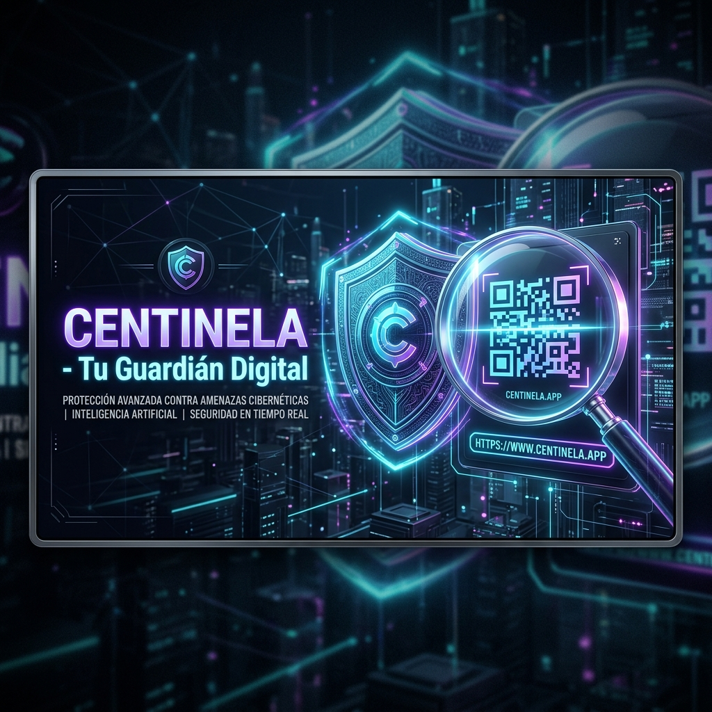

# 🛡️ Centinela — Tu Guardián Digital

Centinela es una PWA (Aplicación Web Progresiva) de ciberseguridad diseñada específicamente para personas no técnicas. Permite verificar si un enlace (URL) o código QR es seguro o fraudulento en cuestión de segundos, previniendo posibles ataques de *phishing* y descargas de malware.

🌍 **Enlace en vivo:** [https://centinela-pwa.pages.dev](https://centinela-pwa.pages.dev)

---

## 🎯 Objetivo y Filosofía

Esta aplicación ha sido rediseñada desde cero ("A prueba de abuelas") con un solo objetivo en mente: **Hacer que la ciberseguridad sea amigable y accesible para toda tu familia**.

En lugar de lanzar informes técnicos, Centinela usa un **Sistema de Semáforos** claro:
- 🟢 **Seguro:** Ningún motor de seguridad ha encontrado actividad sospechosa.
- 🟡 **Sospechoso:** Existen alertas o la identidad del sitio no está clara.
- 🔴 **Peligroso:** Positivo para Malware o Phishing. **¡No entres!**

---

## ✨ Superpoderes Incluidos (v2.1+)

Centinela ahora incluye funciones avanzadas de protección que no encontrarás en otros escáneres:

### 🕵️ Efecto Rayos X (Anti-Redirecciones)
¿Te han pasado un enlace corto tipo `bit.ly` o `t.co`? Centinela lo atraviesa para mostrarte la **URL real de destino** y el título de la página antes de que hagas clic.

### 📸 Vista Previa Segura (Aislamiento Total)
¿Tienes curiosidad pero te da miedo entrar? Con un toque, genera una **fotografía real** de la web. Podrás ver su aspecto sin que tu móvil llegue a interactuar nunca con el sitio malicioso.

### 🏢 Detector de Identidad (Anti-Phishing)
Centinela conoce los dominios oficiales de bancos (CaixaBank, Santander, etc.) y marcas (Amazon, PayPal). Si una web intenta imitar a una de estas marcas pero usa un dominio falso, Centinela te avisará a gritos: **"¡Posible Suplantación!"**.

### 👼 Modo Ángel de la Guarda (Botón SOS)
Configura el teléfono de una persona de confianza (tu "experto"). Si Centinela te da un aviso naranja y no sabes qué hacer, pulsa **"Preguntar"** para enviarle automáticamente un informe por WhatsApp a tu experto.

---

## 📱 Instalación y Uso Móvil

Al ser una PWA, Centinela se comporta como una App nativa:
1.  **Instalación:** Dale a "Añadir a pantalla de inicio" en tu navegador.
2.  **Menú Compartir:** Centinela aparece en el menú de "Compartir" de Android e iOS. Mantén pulsado un enlace en WhatsApp y envíalo directamente a Centinela.
3.  **Accesos Directos:** Mantén pulsado el icono en tu pantalla de inicio para abrir directamente el escáner de códigos QR.

---

## 🛠️ Stack Tecnológico

- **Frontend:** HTML5, CSS3 (Vanilla) y JS (ES6 Modules).
- **Backend:** Cloudflare Workers (Serverless Proxy).
- **Inteligencia:** VirusTotal v3 API.
- **Visualización:** WordPress mshots API.

---

## 📖 Manual de Usuario
Puedes consultar la [Guía Completa de Seguridad](manual.html) dentro de la propia aplicación o en el archivo del repositorio.

## 🤝 Colaboradores
Proyecto mantenido y desarrollado por [Michel Macias](https://github.com/MaciasIT).
