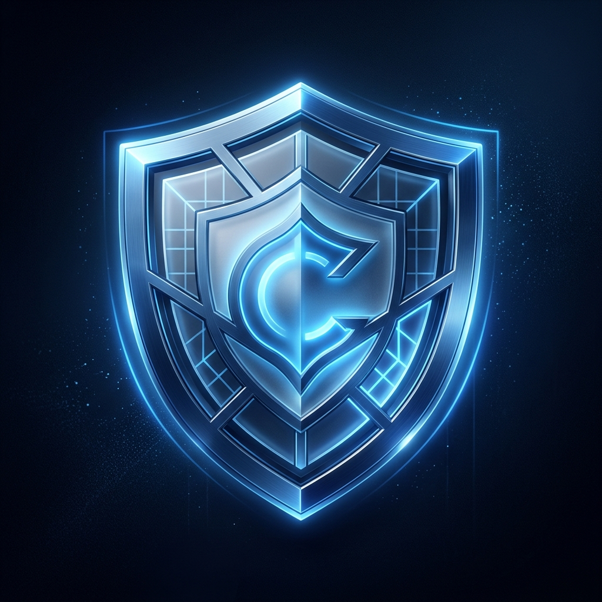

# 🛡️ Centinela — Tu Guardián Digital

Centinela es una PWA (Aplicación Web Progresiva) de ciberseguridad diseñada específicamente para personas no técnicas. Permite verificar si un enlace (URL) o código QR es seguro o fraudulento en cuestión de segundos, previniendo posibles ataques de *phishing* y descargas de malware.

🌍 **Enlace en vivo:** [https://centinela-pwa.pages.dev](https://centinela-pwa.pages.dev)

---

## 🎯 Objetivo y Filosofía

Esta aplicación sucede a la versión anterior "ScanTxungoQR", habiendo sido rediseñada desde cero ("A prueba de abuelas") con un solo objetivo en mente: **Hacer que la ciberseguridad sea amigable y accesible para toda tu familia**.

En lugar de lanzar informes técnicos en la cara del usuario, Centinela usa un **Sistema de Semáforos** extremadamente claro:
- 🟢 **Verde (Seguro):** Ningún motor de seguridad ha encontrado actividad fuera de lo común.
- 🟡 **Naranja (Sospechoso):** Existen alertas menores. La app aconseja precaución.
- 🔴 **Rojo (Peligroso):** Escáner positivo para Malware o Phishing en múltiple motores. Alerta máxima.

*(Para los usuarios avanzados, Centinela sigue deparando un menú colapsable donde consultar el detalle numérico exacto proveniente de la API).*

---

## ✨ Características Principales

- 📱 **Instalable sin tiendas:** Al ser una PWA completa, puedes "Añadir a la pantalla de inicio" desde tu teléfono (sea Android o Safari en iOS) y usarla de forma nativa sin pasar por las tiendas oficiales.
- 🚀 **Integración profunda (Web Share Target):** Centinela se añade mágicamente al menú de "Compartir" de tu móvil. Si alguien en WhatsApp te pasa un enlace o QR sospechoso, solo tienes que mantenerlo pulsado y compartirlo directamente a Centinela para analizarlo en 1 segundo.
- 📷 **Reconocimiento QR Híbrido:** ¿No quieres entrar al enlace cifrado del QR? Abre la cámara o adjunta la imagen para analizar a dónde apunta antes de visitarlo.
- 💨 **Offline first y Ultraligera:** Su caché se encarga de reaccionar sin problemas a recargas gracias a un poderoso Service Worker propio.

## 🛠️ Stack Tecnológico v2.0

Para mantener la base asombrosamente ligera y sin costuras o librerías pesadas previas (se han suprimido React, MUI, etc), la app consta de:

- **Frontend:** Vanilla HTML, JS (módulos ES6) y CSS.
- **Backend (API Proxy):** Cloudflare Workers.
- **Seguridad:** [VirusTotal v3 API](https://developers.virustotal.com/reference/overview).

## 🪛 Arquitectura del Proxy de Cloudflare (Centinela-API)

Puesto que los navegadores bloquean las peticiones originadas desde dominios distintos (CORS) y VirusTotal requiere que escondas tu contraseña (API Key), el proyecto dispone de la carpeta oculta `worker/`. Consiste en un script backend sin servidor (*Serverless*) en Cloudflare que recibe las de URLs de la app de frontend, implementa matemáticas de validación, reintentos asíncronos para peticiones «en cola», y escupe los datos limpios.

## 🤝 Colaboradores
Proyecto original mantenido y rehecho por [Michel Macias](https://github.com/MaciasIT).
