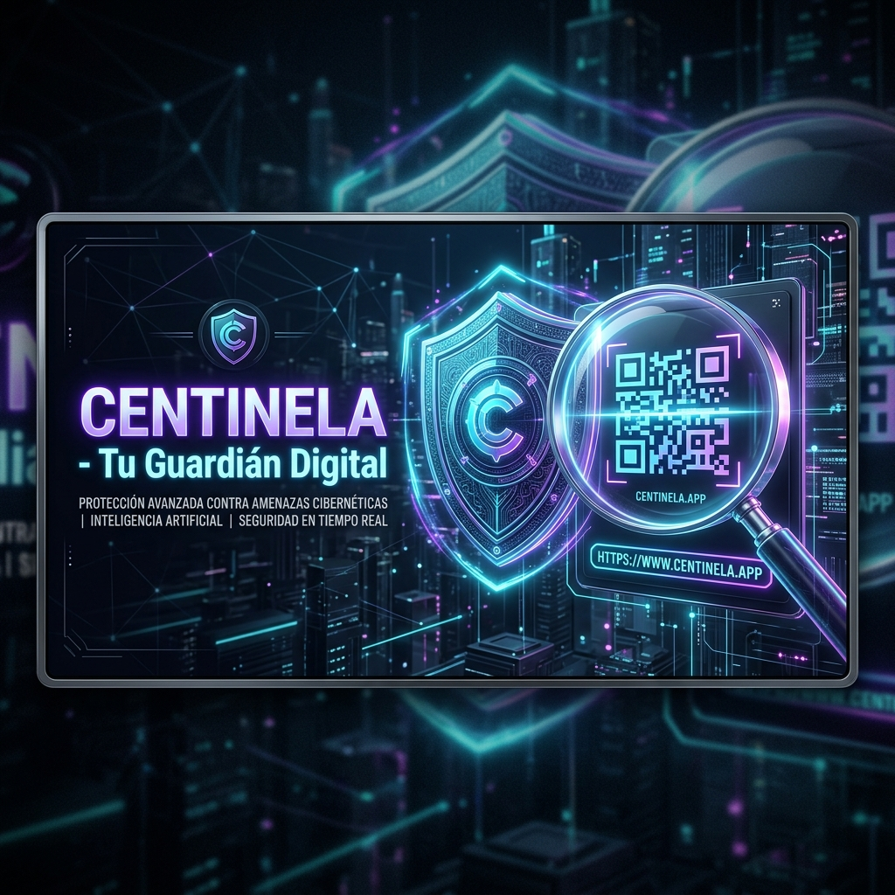

# 🛡️ Centinela — Tu Guardián Digital

Centinela es una PWA (Aplicación Web Progresiva) de ciberseguridad diseñada para personas no técnicas. Permite verificar enlaces y códigos QR en segundos, previniendo phishing y malware con una interfaz simple tipo semáforo.

🌍 **Enlace en vivo:** [https://centinela-pwa.pages.dev](https://centinela-pwa.pages.dev)

---

## 🎯 Filosofía

Ciberseguridad sin jerga. Sin informes técnicos. Solo un veredicto claro:
- 🟢 Seguro
- 🟡 Sospechoso
- 🔴 Peligroso

---

## ✅ Características completadas

| Feature | Fase | Estado |
|---------|------|--------|
| Escaneo rápido de URL/QR | F1 | ✅ |
| Semáforo 🟢🟡🔴 con explicación sencilla | F1 | ✅ |
| Vista previa aislada (mshots) | F1 | ✅ |
| Detección de identidad sospechosa | F1 | ✅ |
| Indicador de dominio reciente | F1 | ✅ |
| Compartir resultado | F1 | ✅ |
| PWA instalable + share target | F1 | ✅ |
| Accesibilidad básica (`aria-live`, Escape, foco) | F1 | ✅ |
| Healthcheck worker `/health` | F2 | ✅ |
| Dashboard estadísticas local | F2 | ✅ |
| Navegación inferior: Inicio \| Estadísticas \| Historial \| Ajustes | F2-F3 | ✅ |
| Sistema screens/partials + router | F3 | ✅ |
| Store observable (`getState`, `subscribe`, `reset`) | F3 | ✅ |
| Componentes reutilizables: button, dialog, toast, spinner, result-card | F3 | ✅ |
| Pantalla Historial con filtros | F3 | ✅ |
| Pantalla Configuración (guardian phone, borrado datos) | F3 | ✅ |
| Motor reputación local (RDAP, entropía, TLDs riesgo, lista negra) | F4 | ✅ |
| Endpoint `POST /api/local-check` con cache 24h | F4 | ✅ |
| Veredicto local inmediato en frontend | F4 | ✅ |

## 🛠️ Stack

- **Frontend:** HTML5 + CSS + JS ESM (Vite)
- **Backend:** Cloudflare Worker (`worker/`)
- **Motores:** VirusTotal v3, Google Safe Browsing, URLScan.io
- **Reputación local:** RDAP, entropía, TLDs de alto riesgo, lista negra
- **Preview:** WordPress mshots
- **Despliegue:** Cloudflare Pages + GitHub Actions

---

## 📱 Uso

1. Pega o comparte un enlace
2. Pulsa **Comprobar**
3. Lee el semáforo y decide

---

## 📖 Documentación

- `PLAN_MEJORAS_2026-07-20.md` — roadmap y fases
- `docs/validacion-centinela-main-2026-08-30.md` — última validación
- `manual.html` — guía de usuario

---

## 🤝 Proyecto

Mantenido por [Michel Macias](https://github.com/MaciasIT) · Repo: `MaciasIT/Centinela_PWA`
